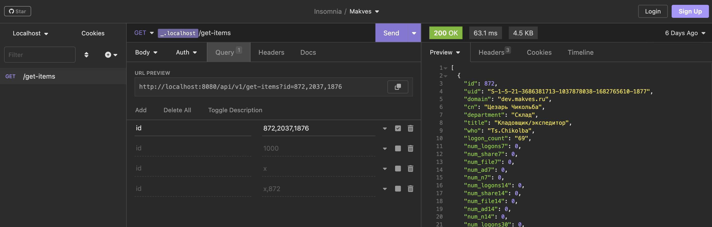

### Описание тестового задания

Необходимо создать web-сервис с командой GET  /get-items на вход принимающей идентификаторы записей (поле id), возвращающей массив json’ов c данными по этим идентификаторам.

Решение должно поддерживать go mod. Библиотеки можно использовать любые работающие на golang 1.19 windows.

Файл с данными table.csv

---

### Run

``test_task_makvex.exe table.csv``

---

Проект также можно собрать под darwin, совместим с go 1.20

В файле Insomnia.json конфигурация для, собственно, [инсомнии](https://insomnia.rest/products/insomnia) (аналог постмана)

